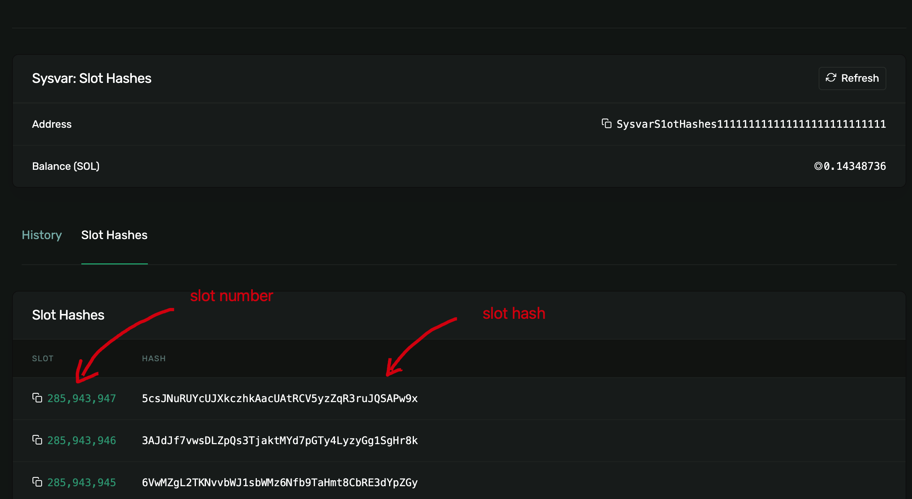

# BEYOND THE BLOCK: SYSVARS

In Solana, sysvars are` read-only system accounts` that give Solana programs access to the blockchain state as well as network information. They are similar to Ethereum `global variables`, which also enable smart contracts to access network or blockchain state information, but they have unique public addresses like the Etherem precompiles.


## Slot vs blocks

Differentiating between solana slots and blocks--A slot is a window of time(about 400ms, millisecond) where a designated leader can produce a block.A slot contains a block(the same kind of block on Ethereum, i.e a list of transactions).However, a slot might not contain a block if the block failed to produce a block during that slot. Their relationship is illustrated below:


Although every block maps to exactly one solt, the block hash is not the same as the slot hash.

Let's take an example from the image below from the Solana block explorer:



Click the slot number: [285,943,947](https://explorer.solana.com/block/285943947?cluster=testnet), you will get the details of this slot.


As a test, click on any slot number in the explorer [here](https://explorer.solana.com/address/SysvarS1otHashes111111111111111111111111111/slot-hashes?cluster=testnet) and try it out.


## Accessing Via Get Method

In Anchor programs, you can access sysvars in two ways: either by using the anchor's get method wrapper, or by treating it as an account in your `#[Derive(Accounts)]` using it's public address.

Not all sysvars can be accessed using Anchor's get method, `Clock`, `EpochSchedule` are available for example.


### Clock

 `Clock` has been covered in last tutorial.


### EpochSchedule

Let's try EpochSchedule directly

```sh
anchor new day_12
```

```rust
#[program]
pub mod day_12 {
    use super::*;

    pub fn initialize(ctx: Context<Initialize>) -> Result<()> {
        let epoch = EpochSchedule::get()?;
        msg!("Epoch: {:?}", epoch);
        Ok(())
    }
}
```

result:


### Rent

add another function and test

```rust
    pub fn rent_test(ctx: Context<Initialize>) -> Result<()> {
        let rent = Rent::get()?;
        msg!("Rent: {:?}", rent);
        Ok(())
    }
```

result:


## Accessing Via Public Address

For sysvars that don't support the get method, we can access them using their public addresses.

Any expections to this will be specified.

```sh
 anchor new day_12_1
```

Add:

```rust
    pub fn get_stake_history(ctx: Context<Initialize>) -> Result<()> {
        let arr = [ctx.accounts.stake_history.clone()];
        let acc_iter = &mut arr.iter();
        let sh_sysvar_info = next_account_info(acc_iter)?;
        msg!("Stake History Sysvar: {:?}", sh_sysvar_info);
        Ok(())
    }
```

update Initialize with new account:

```rust

#[derive(Accounts)]
pub struct Initialize<'info> {
    /// CHECK:
    pub stake_history: AccountInfo<'info>,
}
```

update test file:

```rust
import * as anchor from "@coral-xyz/anchor";
import { Program } from "@coral-xyz/anchor";
import { Day12 } from '../target/types/day_12';

describe("day_12", () => {
  anchor.setProvider(anchor.AnchorProvider.env());
  const program = anchor.workspace.Day12 as Program<Day12>;
  const stakeHistoryPubKey = new anchor.web3.PublicKey("SysvarStakeHistory1111111111111111111111111");

  it("should succeed to get epoch schedule!", async () => {
    const tx = await program.methods.initialize().rpc();
    console.log("You tx signature:", tx);
  })

  it("should succeed to get rent info!", async () => {
    const tx = await program.methods.rentTest().rpc();
    console.log("You tx signature:", tx);
  })

  it.only("should succeed to get stake history info!", async () => {
    const tx = await program.methods.
      getStakeHistory().
      accounts({
        stakeHistory: stakeHistoryPubKey
      }).rpc();
    console.log("You tx signature:", tx);
  })
})
```

result:


## Key Takeaways


## Links

- day_12 original article: https://www.rareskills.io/post/solana-sysvar
- source code: https://github.com/dukedaily/solana-expert-code/tree/day_12